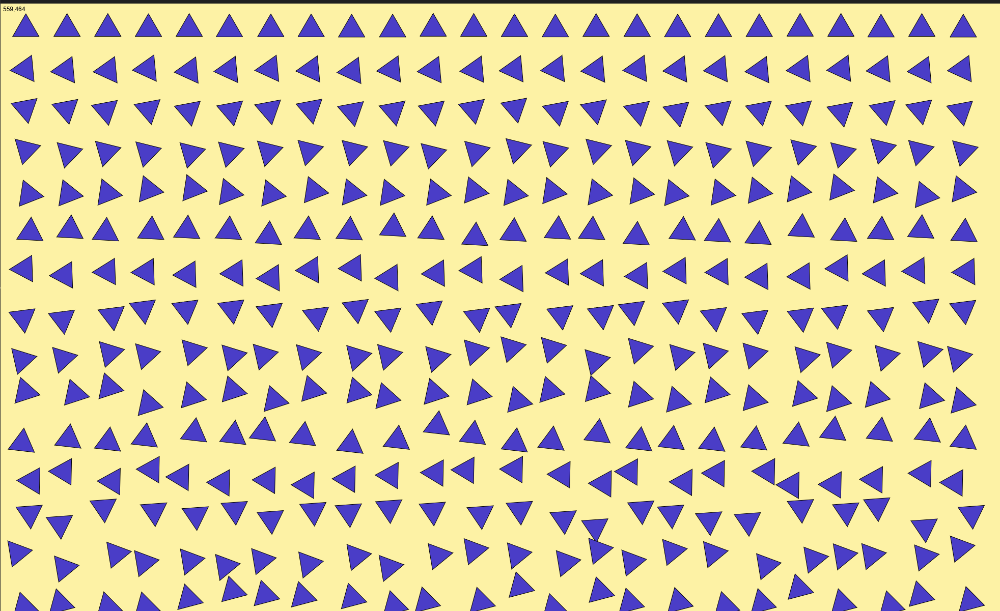

For this assignment, I first created a grid of shapes using two nested for-loops. I started with circles, and then used map() on the Y axis so that the shapes at the top stay straight while the ones at the bottom rotate more. This way the composition gradually becomes more chaotic, inspired by Georg Nees’ Schotter.

Then I added interactivity. When the mouse is pressed, the circles switch to triangles, and I applied random displacement so the triangles shake and look disorderly. When the mouse is not pressed, the shapes stay as circles.

Finally, I made the colors respond to mouse movement.

